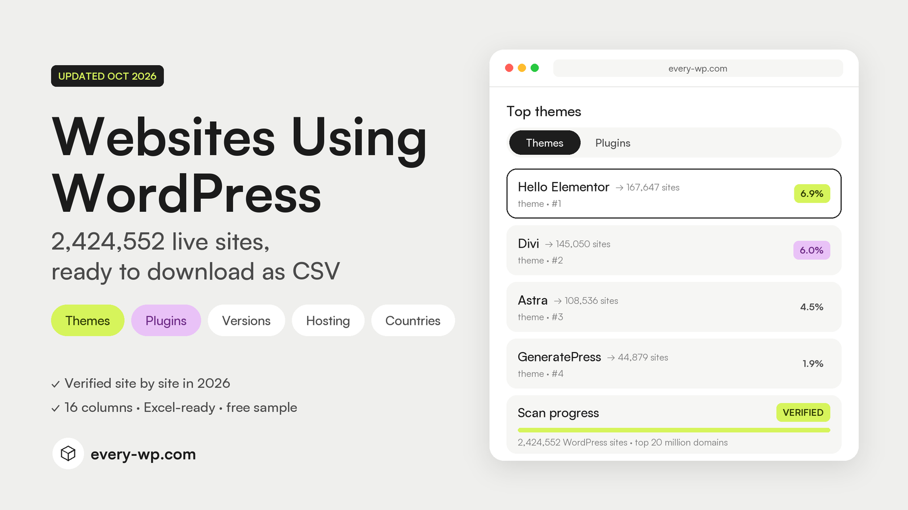
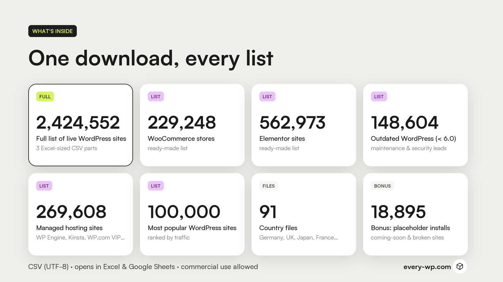
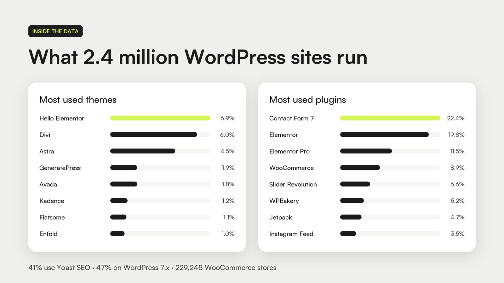

# Websites Using WordPress: 2.4 Million+ Site List (2026)

A list of **2,424,552 live websites using WordPress**, verified site by site between September 30 and October 3, 2026, with theme,
plugins, WordPress version, page builder, SEO plugin, hosting, language and country for every site.

**[⬇ Download the free 1,000-row sample](sample/wordpress-sites-sample-1000.csv)** ·
**[Get the full dataset at every-wp.com](https://every-wp.com/)** ·
**[WordPress statistics 2026](https://every-wp.com/wordpress-statistics/)**

---

## Why this list is different

Most "WordPress sites" lists are scraped once and resold for years. This one was built by visiting
every domain in the top 20 million of a 100-million-domain popularity ranking, between September 30
and October 3, 2026:

- **Verified individually.** Each homepage was checked for WordPress fingerprints (generator tag, REST API,
  theme and plugin files served by the site itself, WordPress cookies), with deeper probes for unclear cases.
  99% are confirmed by a definitive marker.
- **Live sites only.** 18,895 "coming soon", maintenance, default-install and broken WordPress sites were
  moved into a separate bonus file.
- **No hot-link false positives.** A non-WordPress site that embeds an image from a WordPress site isn't counted.
- **Sorted by popularity.** Every row keeps its traffic rank, so the biggest sites come first.

## Preview

Real rows from the dataset (6 of 16 columns shown):

| Rank | Domain | Theme | WordPress | SEO plugin | Hosting |
|---:|---|---|---|---|---|
| 82 | techcrunch.com | tc-24 | 6.9.9 | Yoast SEO | WordPress.com VIP |
| 180 | berkeley.edu | berkeleygateway | 7.0.6 | Yoast SEO | WP Engine |
| 198 | plos.org | plos | 7.1.2 | Yoast SEO | Kinsta |
| 214 | nasa.gov | nasa | 7.0.6 | Rank Math | – |
| 366 | campaignmonitor.com | cm-theme | 6.7.8 | Yoast SEO | WP Engine |

Want to check the quality yourself? The [free sample](sample/wordpress-sites-sample-1000.csv) has 1,000
random rows with every column.

## What's in the full dataset

| File | Rows |
|---|---:|
| Full list of live websites using WordPress (3 Excel-sized CSV parts) | 2,424,552 |
| WooCommerce stores | 229,248 |
| Elementor websites | 562,973 |
| Sites on outdated WordPress (below 6.0) | 148,604 |
| Sites on managed WordPress hosting (WP Engine, Kinsta, WordPress.com VIP…) | 269,608 |
| Top 100,000 most popular WordPress sites | 100,000 |
| Country files (Germany, UK, Japan, France, Italy, Australia…) | 91 files |
| Bonus: placeholder, maintenance and broken installs | 18,895 |

### Columns

`rank` · `domain` · `url` · `title` · `language` · `country_code` · `country` · `wordpress_version` ·
`theme` · `child_theme` · `plugins` · `plugin_count` · `ecommerce` · `page_builder` · `seo_plugin` ·
`multilingual` · `hosting` · `web_server` · `confidence` · `last_checked`

All files are UTF-8 CSV and open in Excel, Google Sheets, LibreOffice, Python, R or any database.
No email addresses or personal data are included.

## WordPress statistics from the data

**Most used themes**

| # | Theme | Sites | Share |
|---:|---|---:|---:|
| 1 | Hello Elementor | 167,647 | 6.9% |
| 2 | Divi | 145,050 | 6.0% |
| 3 | Astra | 108,536 | 4.5% |
| 4 | GeneratePress | 44,879 | 1.9% |
| 5 | Avada | 44,849 | 1.8% |
| 6 | Kadence | 28,592 | 1.2% |
| 7 | Flatsome | 26,728 | 1.1% |
| 8 | Enfold | 23,608 | 1.0% |

**Most used plugins** (loaded on the homepage)

| # | Plugin | Sites | Share |
|---:|---|---:|---:|
| 1 | Contact Form 7 | 542,608 | 22.4% |
| 2 | Elementor | 479,326 | 19.8% |
| 3 | Elementor Pro | 279,860 | 11.5% |
| 4 | WooCommerce | 214,719 | 8.9% |
| 5 | Slider Revolution | 160,798 | 6.6% |
| 6 | WPBakery Page Builder | 126,775 | 5.2% |
| 7 | Jetpack | 114,128 | 4.7% |
| 8 | Smash Balloon Instagram Feed | 85,004 | 3.5% |

**More numbers**

- **WordPress versions:** 46.5% of sites run 7.x, 15.6% run 6.x, 6.1% are still below 6.0 and 31.8% hide their version.
- **Page builders:** Elementor 23.2%, Divi 6.4%, WPBakery 4.8%, Avada 2.0%, Beaver Builder 1.3%.
- **SEO plugins:** Yoast SEO 40.8%, Rank Math 9.9%, All in One SEO 1.4%.
- **Hosting (when identifiable):** WP Engine 124,564 sites, WordPress.com / VIP 92,524, Hostinger 71,135, Kinsta 30,912.
- **Countries (by domain extension):** Germany 102,332, United Kingdom 75,103, Japan 72,187, Russia 49,737, France 45,865.
- **Languages:** English 57.5%, Japanese 6.8%, German 6.1%, French 4.8%, Spanish 4.0%.

Full report with charts: **[WordPress Statistics 2026](https://every-wp.com/wordpress-statistics/)**.
You're welcome to quote these numbers with a link to this page or to every-wp.com.

## Who uses it

- **WordPress agencies and freelancers:** find sites on outdated WordPress, a page builder you specialise in,
  or a theme you know, and offer maintenance, redesigns or speed work.
- **Plugin and theme developers:** size your market, see which plugins your users pair you with, find competitors' users.
- **Hosting companies and SaaS:** target WooCommerce stores, sites on other hosts, or high-traffic sites by country.
- **SEO and marketing teams:** build outreach lists by niche, language or country.
- **Researchers and analysts:** market share of themes, plugins, builders and hosts across 2.4 million sites.

## FAQ

**How many websites use WordPress?**
In our 2026 scan of the top 20 million domains we confirmed 2,443,447 websites using WordPress: 2,424,552
live sites plus 18,895 placeholder or broken installs. Millions more small WordPress sites exist outside the
most popular domains, so the worldwide total is far higher.

**How accurate is the list?**
Every site was checked individually. 99% are confirmed by a definitive WordPress marker; each row has a
`confidence` column so you can filter.

**Which plugins can be detected?**
Plugins that load files on the homepage. Admin-only plugins can't be seen from outside, so plugin counts are a lower bound.

**Can I use it commercially?**
Yes, for your own business (prospecting, research, analysis). Reselling or redistributing the dataset itself
is not allowed. See the [license](https://every-wp.com/license/).

**How was it built?**
See the [methodology](https://every-wp.com/methodology/): sources, detection signals, confidence levels and every column explained.

## Get the full dataset

**[every-wp.com](https://every-wp.com/)**: 2,424,552 websites using WordPress, 5 ready-made lists,
91 country files, and a bonus file of 18,895 placeholder installs, in one download.

---

The sample in this repository is free to download and evaluate. The full dataset is sold under the
[every-wp.com license](https://every-wp.com/license/). WordPress® is a trademark of the WordPress Foundation;
this project is not affiliated with or endorsed by it.
